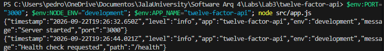
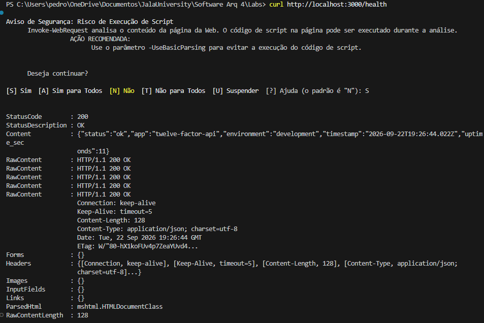
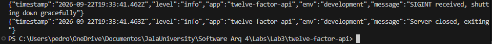
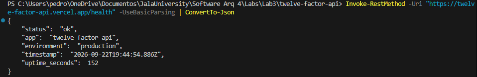

# twelve-factor-api

Scaffold de uma API HTTP minima construida com assistencia de IA, seguindo a metodologia dos [Doze Fatores](https://12factor.net/).

**Linguagem / Framework:** Node.js + Express  
**Deploy:** [Vercel](https://vercel.com)  
**Repositorio:** https://github.com/Aguiarphh/twelve-factor-api

---

## Quick Start

### Pre-requisitos
- Node.js >= 18
- npm

### Instalacao local
```bash
git clone https://github.com/Aguiarphh/twelve-factor-api.git
cd twelve-factor-api
npm install
cp .env.example .env
npm run dev
```

### Verificar
```bash
curl http://localhost:3000/health
```

Resposta esperada:
```json
{
  "status": "ok",
  "app": "twelve-factor-api",
  "environment": "development",
  "timestamp": "2026-09-22T...",
  "uptime_seconds": 2
}
```

---

## Variaveis de Ambiente

Todas as configuracoes sao definidas via variaveis de ambiente. Nunca hardcoded (Factor III).

| Variavel     | Padrao              | Descricao                           |
|--------------|---------------------|-------------------------------------|
| `PORT`       | `3000`              | Porta do servidor HTTP (Factor VII) |
| `NODE_ENV`   | `development`       | Ambiente de execucao                |
| `APP_NAME`   | `twelve-factor-api` | Nome da aplicacao nos logs          |

Veja [.env.example](./.env.example) para detalhes completos.

---

## Scripts

| Comando          | Descricao                                     |
|------------------|-----------------------------------------------|
| `npm start`      | Inicia o servidor com variaveis do sistema    |
| `npm run dev`    | Inicia com `.env` carregado (desenvolvimento) |
| `npm run build`  | Fase de build (sem transpilacao necessaria)   |
| `npm test`       | Smoke test de carregamento do app             |

---

## Mapeamento dos Doze Fatores

| # | Fator | Status | Arquivo / Referencia | Como foi implementado |
|---|-------|--------|----------------------|-----------------------|
| I | Codebase | OK | [`github.com/Aguiarphh/twelve-factor-api`](https://github.com/Aguiarphh/twelve-factor-api) | Um repositorio Git, multiplos ambientes de deploy |
| II | Dependencias | OK | [`package.json`](./package.json) | Todas as dependencias declaradas, `npm install` reproduz o ambiente |
| III | Config | OK | [`.env.example`](./.env.example), [`src/app.js L4-6`](./src/app.js) | `PORT`, `NODE_ENV`, `APP_NAME` lidos de `process.env` |
| IV | Servicos de Apoio | OK | [`.env.example`](./.env.example) | `DATABASE_URL` e `REDIS_URL` tratados como recursos via URL de env |
| V | Build/Release/Run | OK | [`package.json`](./package.json), [`Procfile`](./Procfile), [`scripts/start.sh`](./scripts/start.sh) | Fases separadas: `npm install` (build), config env (release), `node src/app.js` (run) |
| VI | Processos | OK | [`src/app.js`](./src/app.js) | Sem estado em memoria entre requests, cada request e independente |
| VII | Port Binding | OK | [`src/app.js L44`](./src/app.js) | `app.listen(PORT)`, porta lida do ambiente |
| VIII | Concorrencia | OK | [`Procfile`](./Procfile) | Tipo de processo `web` declarado, plataforma pode escalar horizontalmente |
| IX | Descartabilidade | OK | [`src/app.js L51-60`](./src/app.js) | Handler SIGTERM/SIGINT com `server.close()` e timeout de force-exit |
| X | Dev/Prod Parity | Adiado | `NODE_ENV` env var | Mesma codebase, sem Docker local ainda. Ver proximos passos |
| XI | Logs | OK | [`src/app.js funcao log()`](./src/app.js) | JSON estruturado escrito em `stdout` via `process.stdout.write()` |
| XII | Admin Processes | OK | [`scripts/`](./scripts/) | Scripts one-off para iniciar/parar, rodam no mesmo ambiente da app |

**Fator X adiado:** paridade total requer Docker. Adicionado nos proximos passos.

---

## Evidencias de Funcionamento

### Servidor iniciando


### Health check respondendo HTTP 200


### Shutdown gracioso via SIGINT


### Health check em producao (Vercel)


---

## Shutdown Gracioso (Factor IX)

```powershell
# Terminal 1 - iniciar o servidor
$env:PORT="3000"; $env:NODE_ENV="development"; $env:APP_NAME="twelve-factor-api"; node src/app.js

# Pressionar Ctrl+C no Terminal 1 para enviar SIGINT
# Saida esperada:
# {"level":"info","message":"SIGINT received, shutting down gracefully"}
# {"level":"info","message":"Server closed, exiting"}
```

---

## Deploy

URL publica: **https://twelve-factor-api.vercel.app**

```bash
curl https://twelve-factor-api.vercel.app/health
```

Resposta em producao:
```json
{
  "status": "ok",
  "app": "twelve-factor-api",
  "environment": "production",
  "timestamp": "2026-09-22T19:43:47.650Z",
  "uptime_seconds": 84
}
```

Variaveis configuradas no Vercel:
- `NODE_ENV=production`
- `APP_NAME=twelve-factor-api`

---

## Reflexao sobre Colaboracao com IA

### Contexto
Projeto desenvolvido em colaboracao com o agente **Antigravity (Gemini)** como parte do Lab 3 de Software Architecture 4 - JALA University.

### Prompts utilizados

**Prompt 1 - Estrutura da API:**
> "Preciso de um servidor HTTP em Node.js com Express seguindo a metodologia dos 12 fatores. Crie o arquivo `src/app.js` com: endpoint `GET /health` retornando JSON com `status`, `app`, `environment`, `timestamp` e `uptime_seconds`; endpoint `GET /` com mensagem de boas-vindas; toda configuracao (PORT, NODE_ENV, APP_NAME) lida exclusivamente de `process.env` com fallbacks; sem estado em memoria entre requests."

**Prompt 2 - Logs e shutdown gracioso:**
> "No mesmo `src/app.js`, adicione: (1) funcao `log(level, message, meta)` que escreve JSON estruturado direto no `process.stdout`, nunca em arquivo; (2) handlers para `SIGTERM` e `SIGINT` que chamam `server.close()` logando cada etapa, com `setTimeout` de 10s forçando `process.exit(1)` se o servidor nao fechar a tempo."

**Prompt 3 - Arquivos operacionais:**
> "Crie os seguintes arquivos para completar o scaffold dos 12 fatores: `Procfile` com o tipo de processo `web`; `scripts/start.sh` que carrega o `.env` sem sobrescrever variaveis ja exportadas e inicia o servidor; `scripts/stop.sh` que localiza o processo pela porta e envia SIGTERM; `.env.example` documentando PORT, NODE_ENV, APP_NAME e exemplos comentados de DATABASE_URL e REDIS_URL."

**Prompt 4 - Documentacao:**
> "Escreva o README completo com: quick start (clone, install, configuracao do .env, run, curl de verificacao); tabela de variaveis de ambiente com nome, padrao e descricao; tabela de mapeamento dos 12 fatores com colunas de status (OK/Adiado), arquivo de referencia com link e descricao objetiva da implementacao; secao de reflexao sobre colaboracao com IA com o que funcionou, o que foi ajustado e proximos passos."

### O que funcionou bem
- O agente gerou o codigo com os fatores ja integrados de forma natural, sem necessidade de grande correcao
- A tabela de mapeamento foi gerada completa na primeira iteracao
- O handler de shutdown gracioso ficou correto de imediato

### O que eu ajustei
- Simplifiquei os comentarios no codigo, removendo os excessivos
- Escolhi Node.js + Express pela facilidade de deploy no Vercel

### Proximos passos para conformidade total
1. Adicionar `Dockerfile` e `docker-compose.yml` (Fator X)
2. Conectar banco real via `DATABASE_URL` (Fator IV)
3. Configurar GitHub Actions para pipeline CI/CD (Fator V)
4. Adicionar suite de testes com Jest

---

## Estrutura do Projeto

```
twelve-factor-api/
├── src/
│   └── app.js          # API principal
├── scripts/
│   ├── start.sh        # Script de inicializacao
│   └── stop.sh         # Script de parada com SIGTERM
├── .env.example        # Variaveis de ambiente documentadas
├── .gitignore
├── LICENSE
├── Procfile            # Tipo de processo web
├── package.json        # Dependencias e scripts
├── vercel.json         # Configuracao de deploy
└── README.md
```